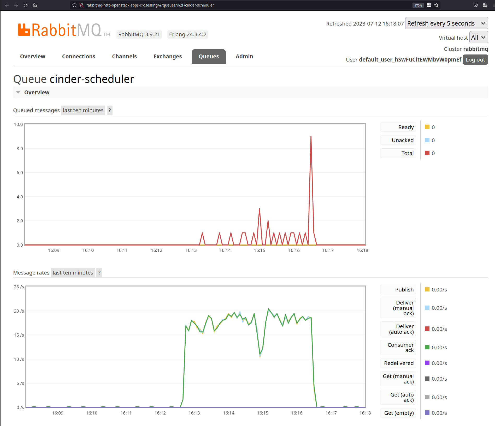
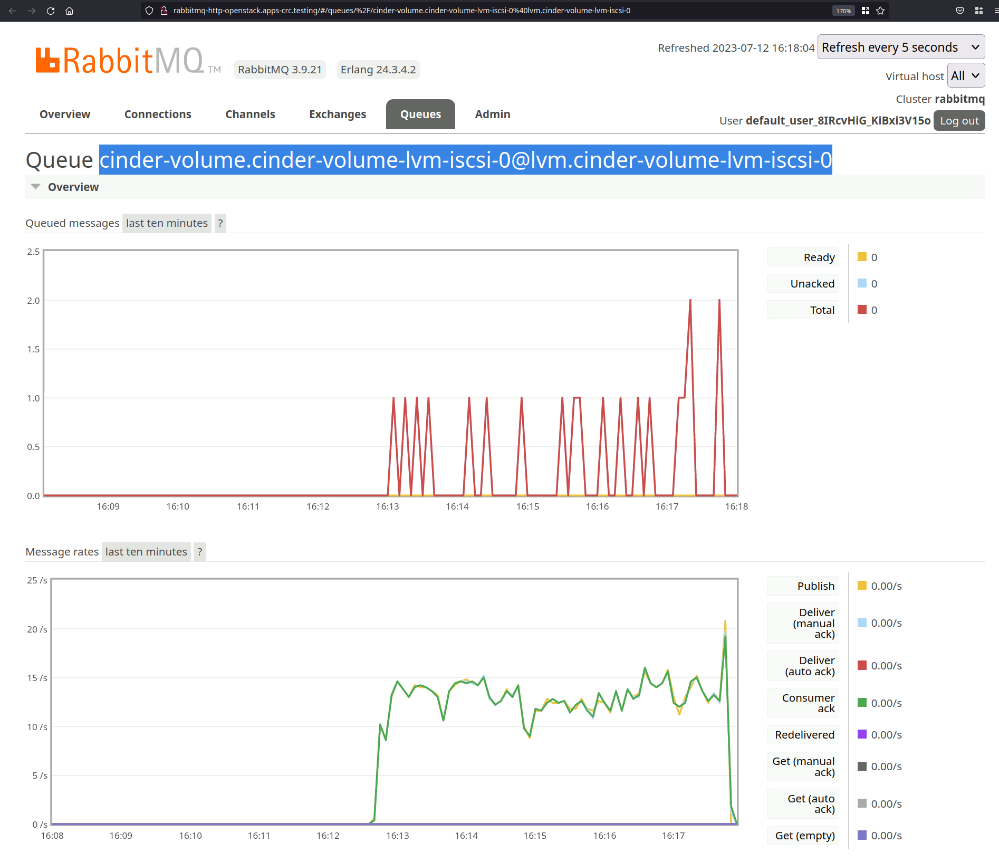

# Scheduler Performance Tests

## Testing without services

The volume and snapshot creation operations in the scheduler were tested without
the DB or RabbitMQ connections to determine the code purely belonging to the
scheduler.

These tests were performed using a couple of rudimentary unit tests that write
to a file called `perf_result.txt` for convenience.

The contents of the `perf_result.txt` after running the tests with `stestr run
-n cinder.tests.unit.scheduler.test_performance_scheduler` were:

```
Scheduler create snapshot: 0.9286364316940308ms
Scheduler create volume: 12.64197552204132ms
```

And the code used in file
`cinder/tests/unit/scheduler/test_performance_scheduler.py` is:

```python
# Licensed under the Apache License, Version 2.0 (the "License"); you may
# not use this file except in compliance with the License. You may obtain
# a copy of the License at
#
#      http://www.apache.org/licenses/LICENSE-2.0
#
# Unless required by applicable law or agreed to in writing, software
# distributed under the License is distributed on an "AS IS" BASIS, WITHOUT
# WARRANTIES OR CONDITIONS OF ANY KIND, either express or implied. See the
# License for the specific language governing permissions and limitations
# under the License.
import copy
import time
from unittest import mock

import ddt
from oslo_config import cfg
from oslo_utils import timeutils

from cinder import context
from cinder import objects
from cinder.scheduler import host_manager
from cinder.scheduler import manager
from cinder.tests.unit import fake_snapshot
from cinder.tests.unit import fake_volume
from cinder.tests.unit.scheduler import fakes as fake_scheduler
from cinder.tests.unit import test


NUM_TESTS = 4000

CONF = cfg.CONF

UTC_NOW = timeutils.utcnow()
SERVICE_STATES = {
    'host1': {'total_capacity_gb': 40000,
              'free_capacity_gb': 40000,
              'allocated_capacity_gb': 0,
              'provisioned_capacity_gb': 0,
              'max_over_subscription_ratio': '1.0',
              'thin_provisioning_support': False,
              'thick_provisioning_support': True,
              'reserved_percentage': 0,
              'volume_backend_name': 'lvm1',
              'timestamp': UTC_NOW,
             },
    'host2': {'total_capacity_gb': 2048,
              'free_capacity_gb': 300,
              'allocated_capacity_gb': 1748,
              'provisioned_capacity_gb': 1748,
              'max_over_subscription_ratio': '1.5',
              'thin_provisioning_support': True,
              'thick_provisioning_support': False,
              'reserved_percentage': 10,
              'volume_backend_name': 'lvm2',
              'timestamp': UTC_NOW,
             }
}


class FakeHostManager(host_manager.HostManager):
    def __init__(self, multibackend_with_pools=False):
        super(FakeHostManager, self).__init__()
        self.service_states = copy.deepcopy(SERVICE_STATES)


@ddt.ddt
class SchedulerManagerPerformance(test.TestCase):
    """Test case for scheduler manager."""

    manager_cls = manager.SchedulerManager
    host_manager_name = ('cinder.tests.unit.scheduler.'
                         'test_performance_scheduler.FakeHostManager')
    driver_cls_name = 'cinder.scheduler.filter_scheduler.FilterScheduler'

    def setUp(self):
        super(SchedulerManagerPerformance, self).setUp()
        self.override_config('scheduler_host_manager', self.host_manager_name)
        self.manager = self.manager_cls(scheduler_driver=self.driver_cls_name)
        self.manager._startup_delay = False
        self.context = context.get_admin_context()

        mock_svc = self.patch('cinder.db.sqlalchemy.api.service_get_all')
        fake_scheduler.mock_host_manager_db_calls(mock_svc)
        self.calculate_loop_time()

        self.file = open('perf_results.txt', 'at')

    def calculate_loop_time(self):
        start = time.time()
        for i in range(NUM_TESTS):
            pass
        end = time.time()
        self.loop_time = ((end - start) / float(NUM_TESTS)) * 1000

    def tearDown(self):
        self.file.close()
        super().tearDown()

    @mock.patch('cinder.objects.volume.Volume.save', lambda x: None)
    @mock.patch('cinder.objects.volume.Volume.get_by_id')
    @mock.patch('cinder.volume.rpcapi.VolumeAPI.create_volume')
    def test_create_volume(self, mock_rpc, mock_get):
        expected_attrs = ['metadata', 'admin_metadata', 'volume_attachment',
                          'glance_metadata']
        volume = fake_volume.fake_volume_obj(self.context,
                                             expected_attrs=expected_attrs)
        mock_get.return_value = volume

        volume_properties = objects.VolumeProperties(
            size=1, user_id=self.context.user_id, status='creating',
            project_id=self.context.project_id, attach_status='detached',
            encryption_key_id=None, display_description='description',
            display_name='test_vol', multiattach=None, bootable=False)
        request_spec = {'volume_id': volume.id, 'volume': volume,
                        'volume_properties': volume_properties}
        request_spec_obj = objects.RequestSpec(**request_spec)

        # Do any setup required by the scheduler prior to the testing
        self.manager.create_volume(self.context, volume,
                                   request_spec=request_spec_obj,
                                   filter_properties={})
        start = time.time()
        for i in range(NUM_TESTS):
            volume.host = None
            self.manager.create_volume(self.context, volume,
                                       request_spec=request_spec_obj,
                                       filter_properties={})
            self.assertIsNotNone(volume.host)
        end = time.time()
        time_call = ((end - start) / float(NUM_TESTS)) * 1000
        real_time = time_call - self.loop_time

        self.file.write(f'Scheduler create volume: {real_time}ms\n')

    @mock.patch('cinder.objects.volume.Volume.save', lambda x: None)
    @mock.patch('cinder.volume.rpcapi.VolumeAPI.create_snapshot')
    def test_create_snapshot(self, mock_rpc):
        expected_attrs = ['metadata', 'admin_metadata', 'volume_attachment',
                          'glance_metadata']
        volume = fake_volume.fake_volume_obj(self.context, host='host1',
                                             expected_attrs=expected_attrs)
        snapshot = fake_snapshot.fake_snapshot_obj(self.context, volume=volume)

        req = objects.RequestSpec(
            snapshot_id=snapshot.id,
            volume_properties=objects.VolumeProperties(size=volume.size))

        # Do any setup required by the scheduler prior to the testing
        self.manager.create_snapshot(self.context, volume, snapshot,
                                     'host1', request_spec=req,
                                     filter_properties={})

        start = time.time()
        for i in range(NUM_TESTS):
            self.manager.create_snapshot(self.context, volume, snapshot,
                                         'host1', request_spec=req,
                                         filter_properties={})
        end = time.time()
        time_call = ((end - start) / float(NUM_TESTS)) * 1000
        real_time = time_call - self.loop_time

        self.file.write(f'Scheduler create snapshot: {real_time}ms\n')
```

## Testing with services

Only the volume creation operation was tested in a running system

### Hardware

The tests were done using an old HP ProLiant DL360 Gen9 machine with:
- CentOS 9 Stream.
- 2 x Intel Xeon E5-2686 V4 - 18-Core 36-Threads 2.30GHz (3.00GHz Boost,
  45MB Cache, 145W TDP)
- 6 x 64GB|PC4-2400-L|x4|Quad Rank

### Environment preparation

OpenStack was deployed in OpenShift using the `install_yaml` repository on a CRC
system.

The CRC system was deployed with:
```bash
$ cd install_yamls/devsetup
$ PULL_SECRET=~/pull-secret.txt CPUS=26 MEMORY=300000 DISK=150 make crc
```

Then `iscsid` and the LVM VG were created using the following manifest:
```yaml
apiVersion: machineconfiguration.openshift.io/v1
kind: MachineConfig
metadata:
  labels:
    machineconfiguration.openshift.io/role: master
    service: cinder
  name: 99-master-cinder-enable-iscsid
spec:
  config:
    ignition:
      version: 3.2.0
    systemd:
      units:
      - enabled: true
        name: iscsid.service
---
apiVersion: machineconfiguration.openshift.io/v1
kind: MachineConfig
metadata:
  labels:
    machineconfiguration.openshift.io/role: master
    service: cinder
    component: cinder-volume
  name: 99-master-cinder-lvm-losetup
spec:
  config:
    ignition:
      version:  3.2.0
    Systemd:
      Units:
      - name: cinder-lvm-losetup.service
        enabled: true
        Contents:  |
          [Unit]
          Description=Cinder LVM losetup
          DefaultDependencies=no
          Conflicts=umount.target
          Requires=lvm2-monitor.service systemd-udev-settle.service
          Before=local-fs.target umount.target
          After=var.mount lvm2-monitor.service systemd-udev-settle.service

          [Service]
          Environment=VG_GB_SIZE=10G
          Environment=LOOPBACK_FILE=/var/home/core/cinder-volumes
          Type=oneshot
          ExecStart=bash -c "if [[ ! -e ${LOOPBACK_FILE} ]]; then /bin/truncate -s ${VG_GB_SIZE} ${LOOPBACK_FILE} && /sbin/vgcreate cinder-volumes `/sbin/losetup --show -f ${LOOPBACK_FILE}`; else /sbin/losetup -f ${LOOPBACK_FILE}; fi"
          ExecStop=bash -c "/sbin/losetup -d `/sbin/losetup -j ${LOOPBACK_FILE} -l -n -O NAME`"
          RemainAfterExit=yes

          [Install]
          WantedBy=local-fs-pre.target
```

After the node was rebooted the usual steps were followed to deploy things:
```
cd install_yamls/devsetup
eval $(crc oc-env)
# Link kubectl to oc since we don't have kubectl installed
ln -s oc `dirname \`which oc\``/kubectl
make crc_attach_default_interface
cd ..
make crc_storage
make input
make openstack
make openstack_deploy
```

Then cinder was configured to use LVM with iSCSI and 10 cinder API services (to
try to remove possible API performance bottlenecks) by editing the existing
`openstackcontrolplane`:

```bash
$ oc edit openstackcontrolplane
```

And replacing the `cinder` section with the following will deploy the cinder
services like we want them. For example the cinder volume service will not be
actually run, though its container will be started with just an endless sleep
thanks to the `debug: service: true` section in the manifest. The `cinderBackup`
section is irrelevant for these tests, but that's what was used so we include it
here as it was:
```yaml
  cinder:
    enabled: true
    template:
      cinderAPI:
        containerImage: quay.io/podified-antelope-centos9/openstack-cinder-api:current-podified
        customServiceConfig: |
          [DEFAULT]
          log_file=
          service_down_time=180
          debug=False
        debug:
          service: false
        externalEndpoints:
        - endpoint: internal
          ipAddressPool: internalapi
          loadBalancerIPs:
          - 172.17.0.80
          sharedIP: true
          sharedIPKey: ""
        replicas: 10
        resources: {}
      cinderBackup:
        containerImage: quay.io/podified-antelope-centos9/openstack-cinder-backup:current-podified
        customServiceConfig: |
          [DEFAULT]
          backup_driver=cinder.backup.drivers.nfs.NFSBackupDriver
          backup_share=192.168.1.2:/Public
        debug:
          service: false
        networkAttachments:
        - storage
        replicas: 1
        resources: {}
      cinderScheduler:
        containerImage: quay.io/podified-antelope-centos9/openstack-cinder-scheduler:current-podified
        customServiceConfig: |
          [DEFAULT]
          debug=False
        debug:
          service: false
        replicas: 1
        resources: {}
      cinderVolumes:
        lvm-iscsi:
          containerImage: quay.io/podified-antelope-centos9/openstack-cinder-volume:current-podified
          customServiceConfig: |
            [DEFAULT]
            debug = False
            [lvm]
            max_over_subscription_ratio=10000000
            image_volume_cache_enabled=false
            volume_driver=cinder.volume.drivers.lvm.LVMVolumeDriver
            volume_group=cinder-volumes
            target_protocol=iscsi
            target_helper=lioadm
            volume_backend_name=lvm_iscsi
          debug:
            service: true
          networkAttachments:
          - storage
          replicas: 1
          resources: {}
      customServiceConfig: |
        [DEFAULT]
        #service_down_time=180
        debug=True
      databaseInstance: openstack
      databaseUser: cinder
      debug:
        dbSync: false
      passwordSelectors:
        database: CinderDatabasePassword
        service: CinderPassword
      preserveJobs: false
      rabbitMqClusterName: rabbitmq
      secret: osp-secret
      serviceUser: cinder
```

As mentioned before, the cinder volume service was setup to not start
automatically to allow us to modify the code and reduce the impact on the node
of the volume creation part:
```bash
$ oc exec -it cinder-volume-lvm-iscsi-0 -- /bin/bash
$ vi /usr/lib/python3.9/site-packages/cinder/volume/flows/manager/create_volume.py
```
And in the `_create_raw_volume` method changing:
```python
   ret = self.driver.create_volume(volume)
```
With:
```python
   # ret = self.driver.create_volume(volume)
   ret = {}
```

Then inside the container the service was started:
```bash
$ /usr/local/bin/kolla_set_configs
$ /usr/local/bin/kolla_start
```

We leave that terminal alone to let the cinder volume service run.

From the host we now modify the quotas to remove the limit on volumes and
gigabytes for the tests:
```bash
$ oc exec -it openstackclient -- openstack quota set --gigabytes=-1 --volumes=-1 admin
```

The final preparation step is to prepare the access to RabbitMQ from outside of
OpenShift.

We add a route to be able to access the RabbitMQ management web server applying
the following manifest:
```yaml
apiVersion: route.openshift.io/v1
kind: Route
metadata:
  labels:
    component: rabbitmq-http
    public: "true"
    service: rabbitmq
  name: rabbitmq-http
  namespace: openstack
spec:
  host: rabbitmq-http-openstack.apps-crc.testing
  port:
    targetPort: management
  to:
    kind: Service
    name: rabbitmq
    weight: 100
  wildcardPolicy: None
```

We get the cinder credentials (\<user>:\<password>) for RabbmitMQ by looking at
the `/etc/cinder/cinder.conf.d/00-global-defaults.conf` file in one of the cinder
containers and looking at the `transport_url` part, and we store it into an
environmental variable:

For example for the tests our value was:
```bash
RABBIT_CREDS=default_user_hSwFuCitEWMbvW0pmEf:rsu1SKU0K8yFvGEANY0VKiyPpAnK8o_F
```

### Running the tests

We are going to be using the
[ApacheBench](https://httpd.apache.org/docs/current/programs/ab.html) to run our
tests, so we make sure it's installed:
```bash
$ sudo dnf -y install httpd-tools
```

And we finally create the JSON for the request, get the credentials for the
tests, and run the volume creation 4000 request with a concurrency of 20 using
the `ab` command:
```bash
$ echo '{"volume": {"size": 1, "consistencygroup_id": null, "snapshot_id": null, "name": "40", "description": null, "volume_type": null, "availability_zone": null, "metadata": {}, "imageRef": null, "source_volid": null, "backup_id": null}}' > create-vol.json
$ token_id=`oc exec -t openstackclient -- openstack token issue -f value -c id`

$ ab -n 4000 -c 20 -p create-vol.json -r \
  -T application/json \
  -H "Accept: application/json" \
  -H "User-Agent: python-cinderclient" \
  -H "X-Auth-Token: $token_id" \
  http://cinder-public-openstack.apps-crc.testing/v3/volumes
```

### Results
The results of running the `ab` command were:
```
This is ApacheBench, Version 2.3 <$Revision: 1903618 $>
Copyright 1996 Adam Twiss, Zeus Technology Ltd, http://www.zeustech.net/
Licensed to The Apache Software Foundation, http://www.apache.org/

Benchmarking cinder-public-openstack.apps-crc.testing (be patient)
Completed 400 requests
Completed 800 requests
Completed 1200 requests
Completed 1600 requests
Completed 2000 requests
Completed 2400 requests
Completed 2800 requests
Completed 3200 requests
Completed 3600 requests
Completed 4000 requests
Finished 4000 requests


Server Software:        Apache
Server Hostname:        cinder-public-openstack.apps-crc.testing
Server Port:            80

Document Path:          /v3/volumes
Document Length:        780 bytes

Concurrency Level:      20
Time taken for tests:   227.157 seconds
Complete requests:      4000
Failed requests:        0
Total transferred:      5012000 bytes
Total body sent:        2480000
HTML transferred:       3120000 bytes
Requests per second:    17.61 [#/sec] (mean)
Time per request:       1135.784 [ms] (mean)
Time per request:       56.789 [ms] (mean, across all concurrent requests)
Transfer rate:          21.55 [Kbytes/sec] received
                        10.66 kb/s sent
                        32.21 kb/s total

Connection Times (ms)
              min  mean[+/-sd] median   max
Connect:        0    0   0.1      0       3
Processing:   430 1131 255.2   1096    4475
Waiting:      430 1131 255.2   1096    4475
Total:        431 1132 255.2   1096    4475

Percentage of the requests served within a certain time (ms)
  50%   1096
  66%   1141
  75%   1173
  80%   1194
  90%   1269
  95%   1363
  98%   1473
  99%   1558
 100%   4475 (longest request)
```

Once the `ab` command returns the scheduler still continues working for a while
since the service was saturated by a higher request rate than the service was
capable of handling.

Graph of the scheduler's queue:


Once we see in the RabbitMQ management website that the scheduler queue is no
longer receiving messages we can collect the stats, where we can see that there
is an **average of ~18.4 messages delivered per second by API services** to the
scheduler's RabbitMQ queue:

```bash
$ AGE=300 curl --silent -u $RABBIT_CREDS 'http://rabbitmq-http-openstack.apps-crc.testing/api/queues/%2F/cinder-scheduler?msg_rates_age=$AGE&msg_rates_incr=1&data_rates_age=$AGE&data_rates_incr=1' | python -m json.tool

{
    "consumer_details": [
        {
            "arguments": {},
            "channel_details": {
                "connection_name": "10.217.0.119:51310 -> 10.217.0.68:5672",
                "name": "10.217.0.119:51310 -> 10.217.0.68:5672 (1)",
                "node": "rabbit@rabbitmq-server-0.rabbitmq-nodes.openstack",
                "number": 1,
                "peer_host": "10.217.0.119",
                "peer_port": 51310,
                "user": "default_user_hSwFuCitEWMbvW0pmEf"
            },
            "ack_required": true,
            "active": true,
            "activity_status": "up",
            "consumer_tag": "1",
            "exclusive": false,
            "prefetch_count": 0,
            "queue": {
                "name": "cinder-scheduler",
                "vhost": "/"
            }
        }
    ],
    "arguments": {},
    "auto_delete": false,
    "backing_queue_status": {
        "avg_ack_egress_rate": 18.594947836717342,
        "avg_ack_ingress_rate": 18.399820310953068,
        "avg_egress_rate": 18.399820310953068,
        "avg_ingress_rate": 18.399820310953068,
        "delta": [
            "delta",
            "undefined",
            0,
            0,
            "undefined"
        ],
        "len": 0,
        "mode": "default",
        "next_seq_id": 6064,
        "q1": 0,
        "q2": 0,
        "q3": 0,
        "q4": 0,
        "target_ram_count": "infinity"
    },
    "consumer_capacity": 1.0,
    "consumer_utilisation": 1.0,
    "consumers": 1,
    "deliveries": [],
    "durable": false,
    "effective_policy_definition": {},
    "exclusive": false,
    "exclusive_consumer_tag": null,
    "garbage_collection": {
        "fullsweep_after": 65535,
        "max_heap_size": 0,
        "min_bin_vheap_size": 46422,
        "min_heap_size": 233,
        "minor_gcs": 108
    },
    "head_message_timestamp": null,
    "idle_since": "2023-07-12 14:16:31",
    "incoming": [],
    "memory": 22640,
    "message_bytes": 0,
    "message_bytes_paged_out": 0,
    "message_bytes_persistent": 0,
    "message_bytes_ram": 0,
    "message_bytes_ready": 0,
    "message_bytes_unacknowledged": 0,
    "message_stats": {
        "ack": 6064,
        "ack_details": {
            "rate": 0.0
        },
        "deliver": 6064,
        "deliver_details": {
            "rate": 0.0
        },
        "deliver_get": 6064,
        "deliver_get_details": {
            "rate": 0.0
        },
        "deliver_no_ack": 0,
        "deliver_no_ack_details": {
            "rate": 0.0
        },
        "get": 0,
        "get_details": {
            "rate": 0.0
        },
        "get_empty": 0,
        "get_empty_details": {
            "rate": 0.0
        },
        "get_no_ack": 0,
        "get_no_ack_details": {
            "rate": 0.0
        },
        "publish": 6064,
        "publish_details": {
            "rate": 0.0
        },
        "redeliver": 0,
        "redeliver_details": {
            "rate": 0.0
        }
    },
    "messages": 0,
    "messages_details": {
        "rate": 0.0
    },
    "messages_paged_out": 0,
    "messages_persistent": 0,
    "messages_ram": 0,
    "messages_ready": 0,
    "messages_ready_details": {
        "rate": 0.0
    },
    "messages_ready_ram": 0,
    "messages_unacknowledged": 0,
    "messages_unacknowledged_details": {
        "rate": 0.0
    },
    "messages_unacknowledged_ram": 0,
    "name": "cinder-scheduler",
    "node": "rabbit@rabbitmq-server-0.rabbitmq-nodes.openstack",
    "operator_policy": null,
    "policy": null,
    "recoverable_slaves": null,
    "reductions": 3152711,
    "reductions_details": {
        "rate": 0.0
    },
    "single_active_consumer_tag": null,
    "state": "running",
    "type": "classic",
    "vhost": "/"
}
```

After another 30 or 40 seconds or so we can see the volume service queue also
stops receiving messages, indicating that the scheduler has finished its work.

Graph of the volume's queue:


Then we can get the volume queue stats, where we can see that there is an
**average of ~15.7 messages processed and sent per second by the scheduler** to
*the volume's RabbitMQ queue:

```bash
$ AGE=360 curl --silent -u $RABBIT_CREDS 'http://rabbitmq-http-openstack.apps-crc.testing/api/queues/%2F/cinder-volume.cinder-volume-lvm-iscsi-0@lvm.cinder-volume-lvm-iscsi-0?msg_rates_age=$AGE&msg_rates_incr=1&data_rates_age=$AGE&data_rates_incr=1' | python -m json.tool

{
    "consumer_details": [
        {
            "arguments": {},
            "channel_details": {
                "connection_name": "10.217.0.120:46944 -> 10.217.0.68:5672",
                "name": "10.217.0.120:46944 -> 10.217.0.68:5672 (1)",
                "node": "rabbit@rabbitmq-server-0.rabbitmq-nodes.openstack",
                "number": 1,
                "peer_host": "10.217.0.120",
                "peer_port": 46944,
                "user": "default_user_hSwFuCitEWMbvW0pmEf"
            },
            "ack_required": true,
            "active": true,
            "activity_status": "up",
            "consumer_tag": "2",
            "exclusive": false,
            "prefetch_count": 0,
            "queue": {
                "name": "cinder-volume.cinder-volume-lvm-iscsi-0@lvm.cinder-volume-lvm-iscsi-0",
                "vhost": "/"
            }
        }
    ],
    "arguments": {},
    "auto_delete": false,
    "backing_queue_status": {
        "avg_ack_egress_rate": 15.84033840832768,
        "avg_ack_ingress_rate": 15.717349345491385,
        "avg_egress_rate": 15.717349345491385,
        "avg_ingress_rate": 15.717349345491385,
        "delta": [
            "delta",
            "undefined",
            0,
            0,
            "undefined"
        ],
        "len": 0,
        "mode": "default",
        "next_seq_id": 6012,
        "q1": 0,
        "q2": 0,
        "q3": 0,
        "q4": 0,
        "target_ram_count": "infinity"
    },
    "consumer_capacity": 1.0,
    "consumer_utilisation": 1.0,
    "consumers": 1,
    "deliveries": [],
    "durable": false,
    "effective_policy_definition": {},
    "exclusive": false,
    "exclusive_consumer_tag": null,
    "garbage_collection": {
        "fullsweep_after": 65535,
        "max_heap_size": 0,
        "min_bin_vheap_size": 46422,
        "min_heap_size": 233,
        "minor_gcs": 4
    },
    "head_message_timestamp": null,
    "idle_since": "2023-07-12 14:17:53",
    "incoming": [],
    "memory": 19568,
    "message_bytes": 0,
    "message_bytes_paged_out": 0,
    "message_bytes_persistent": 0,
    "message_bytes_ram": 0,
    "message_bytes_ready": 0,
    "message_bytes_unacknowledged": 0,
    "message_stats": {
        "ack": 6012,
        "ack_details": {
            "rate": 0.0
        },
        "deliver": 6012,
        "deliver_details": {
            "rate": 0.0
        },
        "deliver_get": 6012,
        "deliver_get_details": {
            "rate": 0.0
        },
        "deliver_no_ack": 0,
        "deliver_no_ack_details": {
            "rate": 0.0
        },
        "get": 0,
        "get_details": {
            "rate": 0.0
        },
        "get_empty": 0,
        "get_empty_details": {
            "rate": 0.0
        },
        "get_no_ack": 0,
        "get_no_ack_details": {
            "rate": 0.0
        },
        "publish": 6012,
        "publish_details": {
            "rate": 0.0
        },
        "redeliver": 0,
        "redeliver_details": {
            "rate": 0.0
        }
    },
    "messages": 0,
    "messages_details": {
        "rate": 0.0
    },
    "messages_paged_out": 0,
    "messages_persistent": 0,
    "messages_ram": 0,
    "messages_ready": 0,
    "messages_ready_details": {
        "rate": 0.0
    },
    "messages_ready_ram": 0,
    "messages_unacknowledged": 0,
    "messages_unacknowledged_details": {
        "rate": 0.0
    },
    "messages_unacknowledged_ram": 0,
    "name": "cinder-volume.cinder-volume-lvm-iscsi-0@lvm.cinder-volume-lvm-iscsi-0",
    "node": "rabbit@rabbitmq-server-0.rabbitmq-nodes.openstack",
    "operator_policy": null,
    "policy": null,
    "recoverable_slaves": null,
    "reductions": 3089977,
    "reductions_details": {
        "rate": 0.0
    },
    "single_active_consumer_tag": null,
    "state": "running",
    "type": "classic",
    "vhost": "/"
}
```

And since we didn't have any volumes prior to the tests we can see how long it
took since the cinder-api wrote the first volume entry to the database until the
volume service finished with the last volume:

```bash
$ oc exec -t openstack-galera-0 -- mysql -ucinder -p12345678 \
  -e 'select min(created_at), max(updated_at) from cinder.volumes where not deleted order by created_at,updated_at'

Defaulted container "galera" out of: galera, mysql-bootstrap (init)
min(created_at) max(updated_at)
2023-07-12 14:12:43     2023-07-12 14:17:52
```

This indicates that it took 309 seconds to complete the 4000 requests, or
**77.25ms per request from the moment the API creates the DB record until a fake
cinder driver completes the volume creation**. The value is greater than the
calculation via RabbitMQ because here we include the time it takes for the API
to make the RPC call, for the volume service to receive the RPC call and run
some code.
